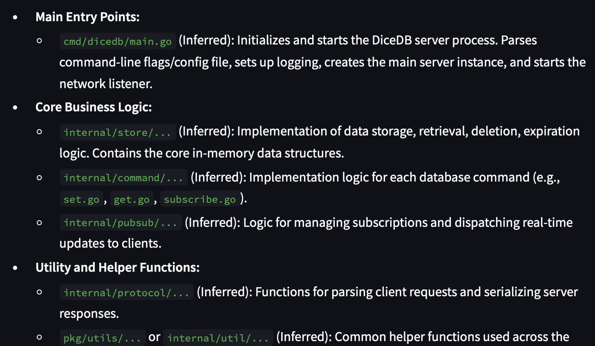

# CloneAcademy

CloneAcademy is an AI-powered tool that automatically generates clear, organized documentation for GitHub repositories.

## Example Output

### Repository Analysis

*Screenshot 1: Repository analysis showing the structure and components of a GitHub repository*

### Generated Documentation

*Screenshot 2: Example of automatically generated documentation with inferred codebase structure*

## Features

- Repository analysis without local cloning
- Support for public repositories
- Automatic documentation generation using Gemini AI
- Key file analysis (README.md, requirements.txt, etc.)
- Markdown output format
- Built-in rate limiting for GitHub API

## Setup

1. Install [uv](https://github.com/astral-sh/uv):
   ```bash
   curl -LsSf https://astral.sh/uv/install.sh | sh
   ```

2. Create a virtual environment and install dependencies:
   ```bash
   uv venv
   source .venv/bin/activate  # On Windows: .venv\Scripts\activate
   uv pip install -e .
   ```

3. Create a `.env` file with your API keys:
   ```
   GOOGLE_API_KEY=your_google_api_key_here
   ```

## Usage

Run the Streamlit app:
```bash
streamlit run cloneacademy/app.py
```

Enter a GitHub repository URL in the input field, and CloneAcademy will:
1. Fetch repository information and structure
2. Analyze key files (README.md, requirements.txt, etc.)
3. Generate comprehensive documentation
4. Save the documentation as a Markdown file

## Rate Limiting

CloneAcademy uses GitHub's public API without authentication, which has the following limits:
- 60 requests per hour for unauthenticated requests
- The application includes built-in rate limiting to stay within these limits
- For higher rate limits, you can add a GitHub token to your `.env` file
